# Implementing Microservices using Spring Boot

This is a sample project to demonstrate how to implement microservices using Spring Boot and give the good practices to build a microservice based on rest or graphql and it manage Bank accounts.

the dependencies used in this project are:

- Spring Web
- Spring Data JPA
- H2 Database
- spring data rest
- spring data graphql
- springdoc-openapi-ui

## How to run the project

- Clone the project
- Run the command `mvn clean install`
- Run the command `mvn spring-boot:run`

## Testing the project

### Testing dao layer:

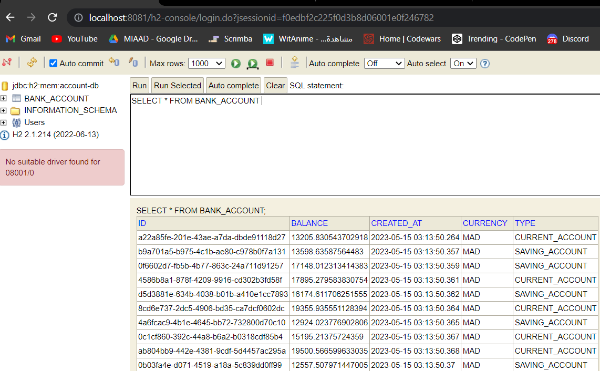  

### Testing using rest client(POSTMAN)

- get all accounts:  
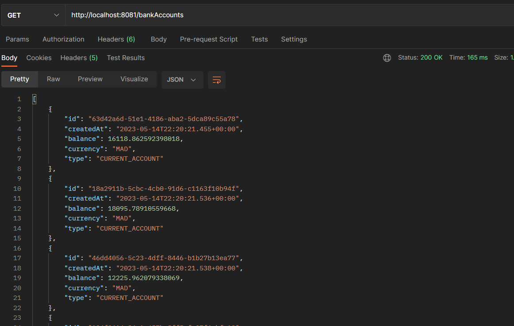  

- get account by id:  
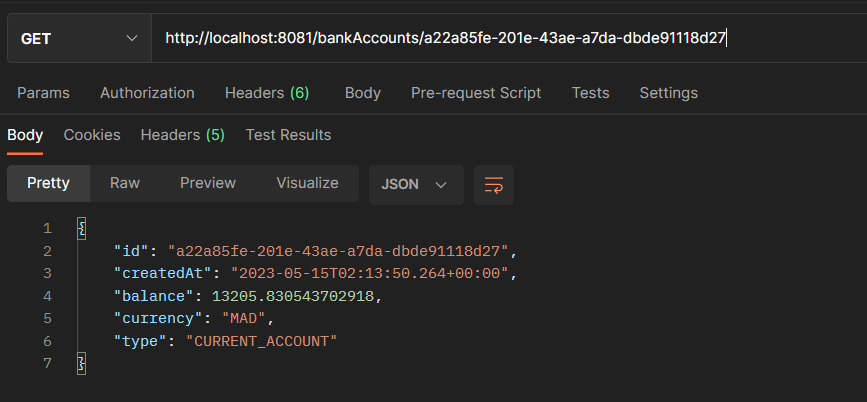  

- create account:  
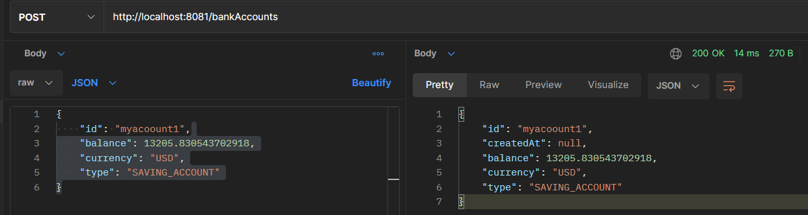

- update account:
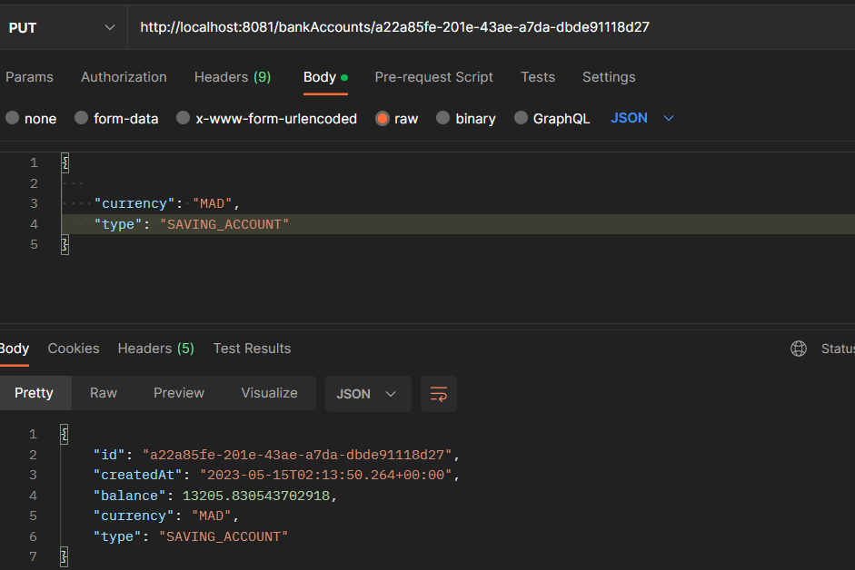  

- delete account:
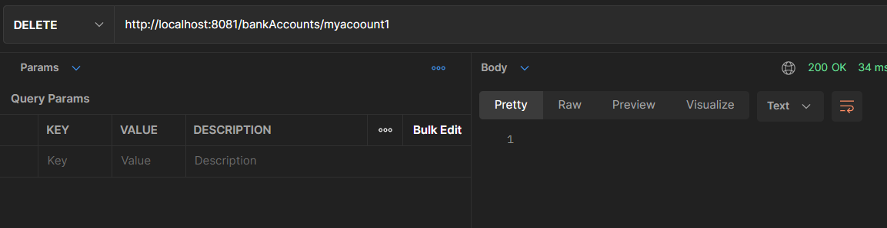

### Generating and Testing Swagger Documentation

- generate swagger documentation:  
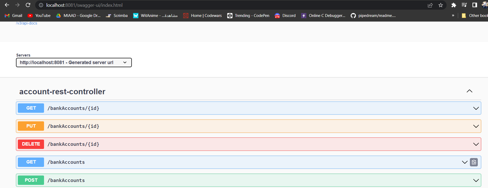  

- get all accounts:  
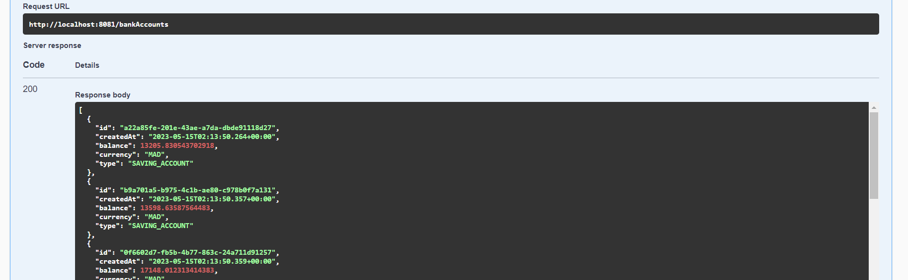  

- create account:  
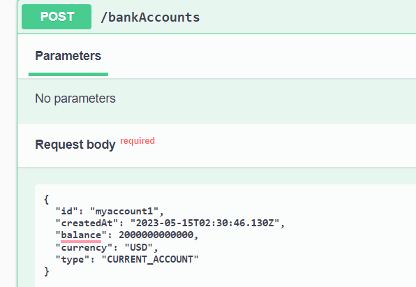  

- update account:  
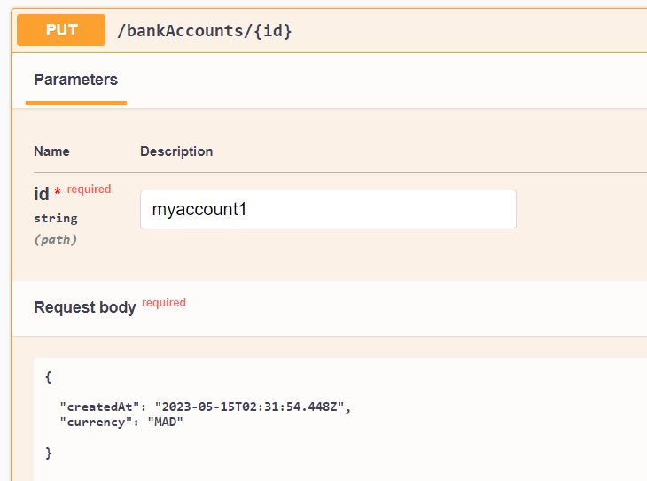

- get account by id:  
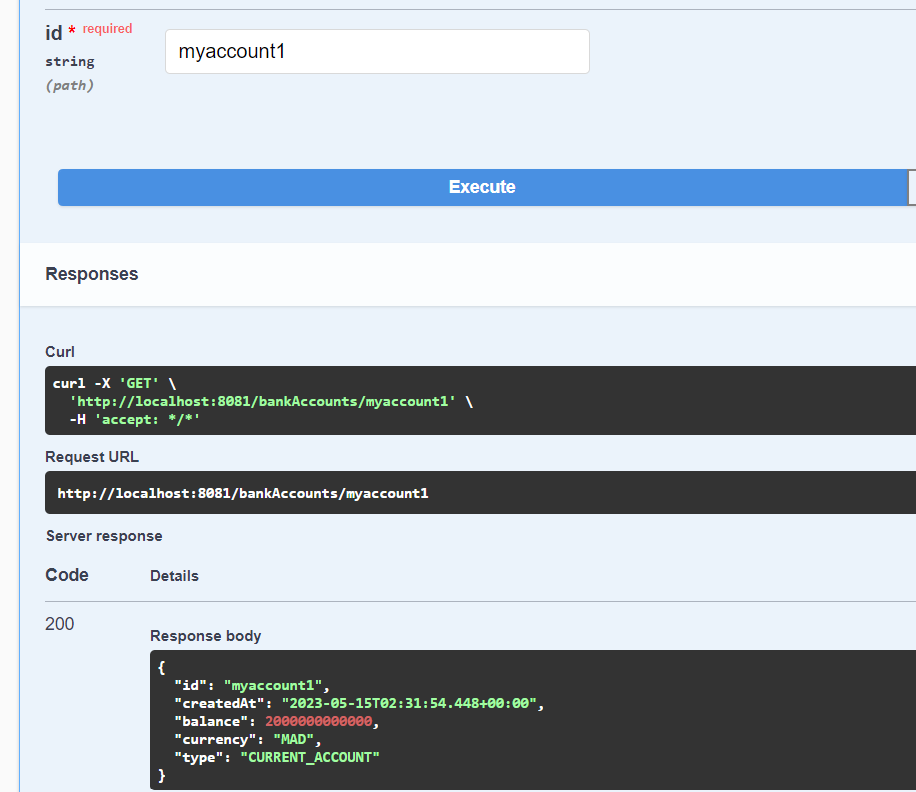

### Testing projection, dtos, Mappers

- projection, pagination with spring data rest:  
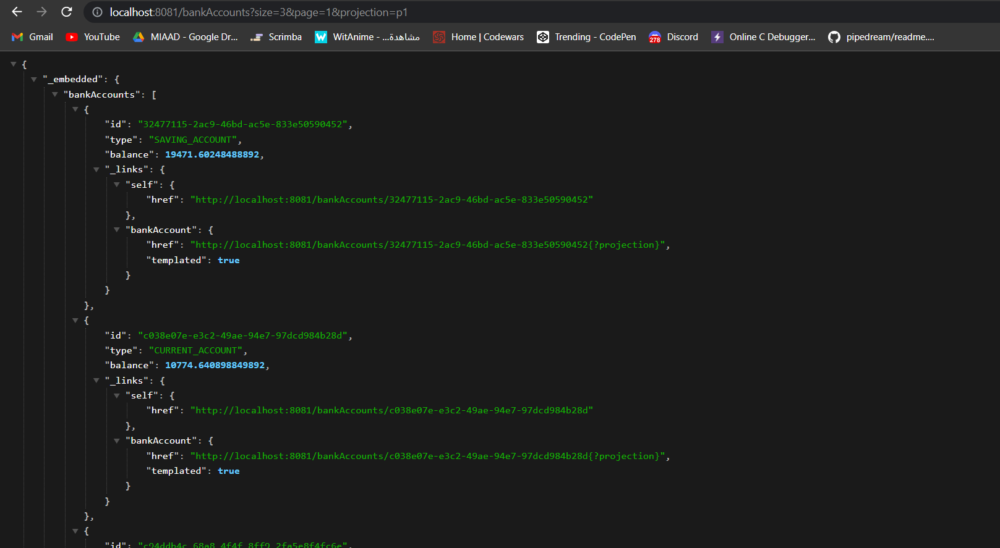

- dto, mapper account creation:  
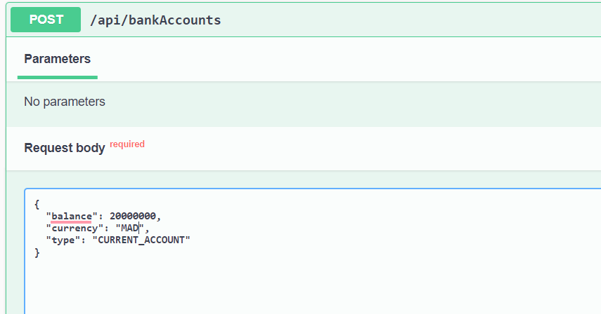

### Testing graphql

- get all accounts:  
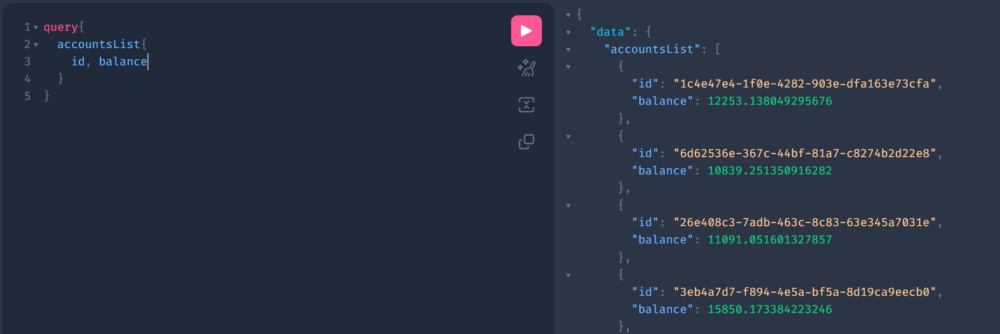

- get account by id:  
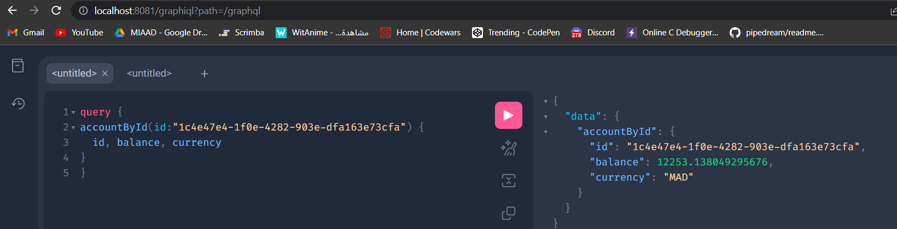  

- create account:  
  

- relation between account and customer:
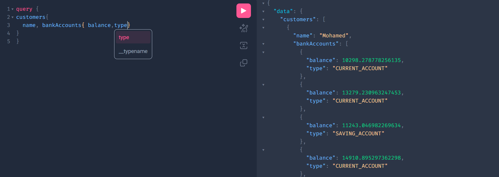

